<div align="center">

# UNICARD

### Multipurpose RFID Card with Reader and Writer Device

One RFID card for identity verification, payments, and door access.

</div>

<p align="center">
	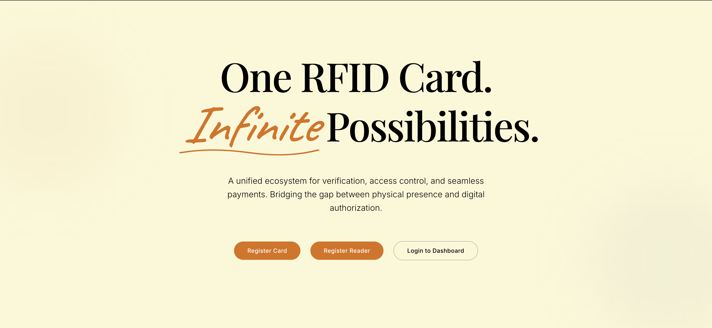
</p>

## Overview

UNICARD is an IoT ecosystem that connects a reusable RFID card to configurable physical readers and a cloud-hosted web interface. The same card can be registered once and then used for several purposes depending on the configuration of the reader it is tapped on:

- **Identification:** accepts only card UIDs added to the reader's authorized-card list.
- **Payment:** checks the card balance, deducts the configured amount, and records the transaction.
- **Door lock:** compares the cardholder's stored door code with the code configured for the reader.

The ecosystem has two independent ESP32 devices:

1. A **writer device** that reads a card UID and hosts the card-registration page.
2. A **reader device** that hosts the reader-registration page, downloads its configuration, reads cards, and displays the result on an OLED screen.

The devices communicate with a cloud API backed by MongoDB. The cloud interface is built with Next.js, while the local ESP32 portals are lightweight HTML, CSS, and JavaScript pages stored in LittleFS.

## System at a Glance

```text
												 2.4 GHz Wi-Fi
			 +----------------------+----------------------+
			 |                                             |
+------+-------+                             +-------+------+
| Writer ESP32 |                             | Reader ESP32 |
| RC522 + RGB  |                             | RC522 + OLED |
| Card portal  |                             | Reader portal|
+------+-------+                             +-------+------+
			 |                                             |
			 | HTTPS: register card                       | HTTPS: register reader,
			 |                                             | fetch configuration,
			 |                                             | verify card, record entry
			 +----------------------+----------------------+
															v
										+-----------------------+
										| Express.js API        |
										| /api/v1               |
										+-----------+-----------+
																|
																v
										+-----------------------+
										| MongoDB               |
										| cards, readers,       |
										| entries               |
										+-----------+-----------+
																^
																|
										+-----------+-----------+
										| Next.js web dashboard |
										| card and reader login |
										+-----------------------+
```

## Main Components

| Component | Responsibility | Implementation |
| --- | --- | --- |
| Writer device | Reads a card UID and registers a cardholder | ESP32, RC522, RGB LED, WiFiManager, LittleFS |
| Reader device | Registers a reader, retrieves configuration, authorizes taps, and displays results | ESP32, RC522, SSD1306 OLED, WiFiManager, LittleFS |
| Local card portal | Collects cardholder details and submits a registration request | HTML, CSS, JavaScript served by the writer ESP32 |
| Local reader portal | Collects reader credentials and mode-specific settings | HTML, CSS, JavaScript served by the reader ESP32 |
| Cloud API | Validates requests, authenticates dashboards, reads card data, updates balances, and stores entries | Express.js, Node.js, MongoDB driver, JWT |
| Cloud dashboard | Provides landing, login, card dashboard, reader dashboard, and activity views | Next.js, React, TypeScript, Framer Motion |
| Database | Stores card, reader, and reader-entry documents | MongoDB |

## Repository Structure

```text
UNICARD/
├── assets/
│   ├── hardware/                    # Hardware photos, GIFs, and demonstrations
│   └── software/                    # Screenshots of portals and dashboards
├── reader_device/
│   ├── reader_device.ino            # Reader ESP32 firmware
│   └── data/
│       ├── register-reader.html     # Reader registration portal
│       └── styles.css               # Portal styling
├── web_interface/
│   └── cloud_hosted/
│       ├── backend/
│       │   ├── server.js            # Express API and MongoDB operations
│       │   ├── package.json
│       │   └── vercel.json
│       └── frontend/
│           ├── app/                 # Next.js routes and page layouts
│           ├── components/          # Dashboard and animation components
│           ├── Services/            # Server actions for API calls
│           ├── assets/images/       # Frontend images
│           └── package.json
├── writer_device/
│   ├── writer_device.ino            # Writer ESP32 firmware
│   └── data/
│       ├── register-card.html       # Card registration portal
│       └── styles.css               # Portal styling
└── README.md
```

## End-to-End Workflow

### 1. Connect an ESP32 to Wi-Fi

Both devices use the **WiFiManager** library. On startup, the firmware tries the previously stored network credentials. The network must be a **2.4 GHz Wi-Fi network** that is also reachable by the phone or laptop used to open the local portal.

If the saved network cannot be found, WiFiManager creates a configuration access point:

- Writer AP: `RFID-Writer-Setup`
- Reader AP: `RFID-Reader-Setup`

Connect the client device to that access point, select the desired Wi-Fi network, and submit its credentials. WiFiManager stores the connection information in the ESP32's persistent storage and automatically reuses it after reboot.

The writer also has a reset button. Holding it for approximately three seconds clears the saved Wi-Fi settings, lights the RGB LED white, restarts the device, and opens the setup flow again.

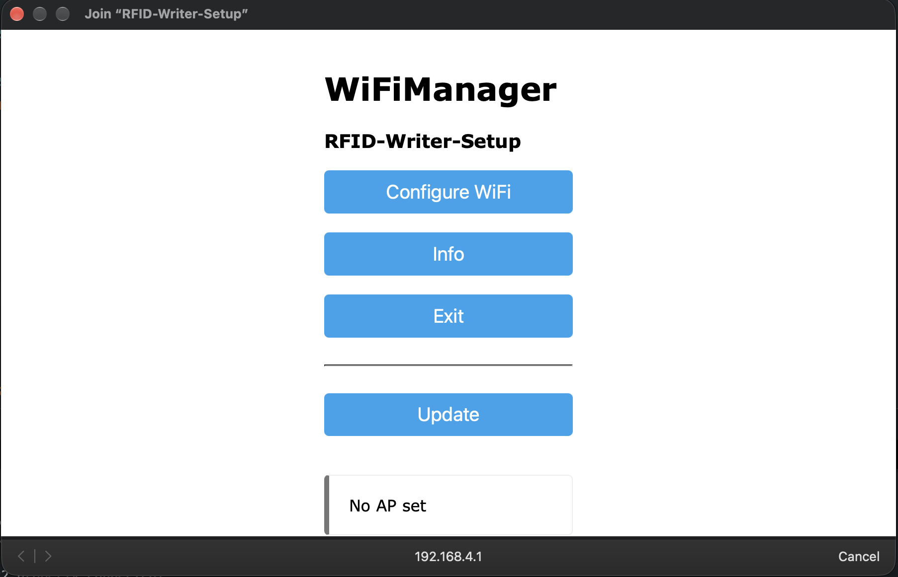

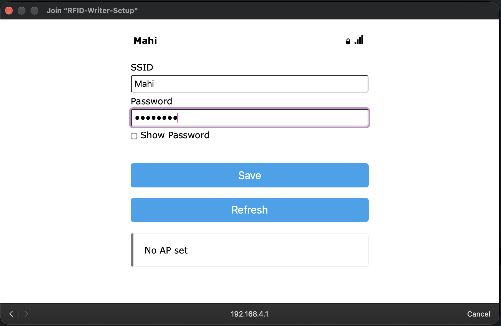

### 2. Register a Card

The writer advertises the mDNS hostname `writer`, so the local portal is available at:

```text
http://writer.local/register-card
```

The registration sequence is time-sensitive:

1. Open the card registration page.
2. Place an RFID card on the writer's RC522 reader.
3. Wait for the UID to be read.
4. Complete the form with the cardholder's name, phone number, email, initial balance, optional door code, and dashboard password.
5. Submit the form within **10 seconds** of the card tap.

The writer keeps the captured UID in memory for 10 seconds. The UID is not typed into the form; firmware injects it into the JSON request sent to the cloud API.

The RGB status LED is active-low in the firmware:

| LED state | Meaning |
| --- | --- |
| Yellow | Registration request is being processed |
| Green | Card registration succeeded |
| Red | Registration failed, no card was detected, or the request was rejected |
| White | Wi-Fi settings are being reset |

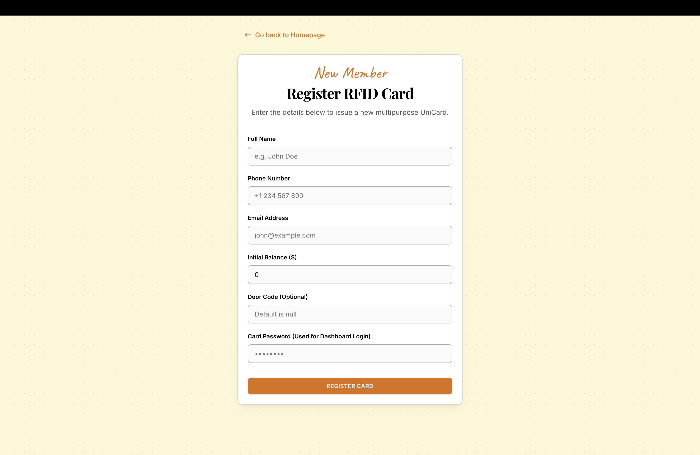

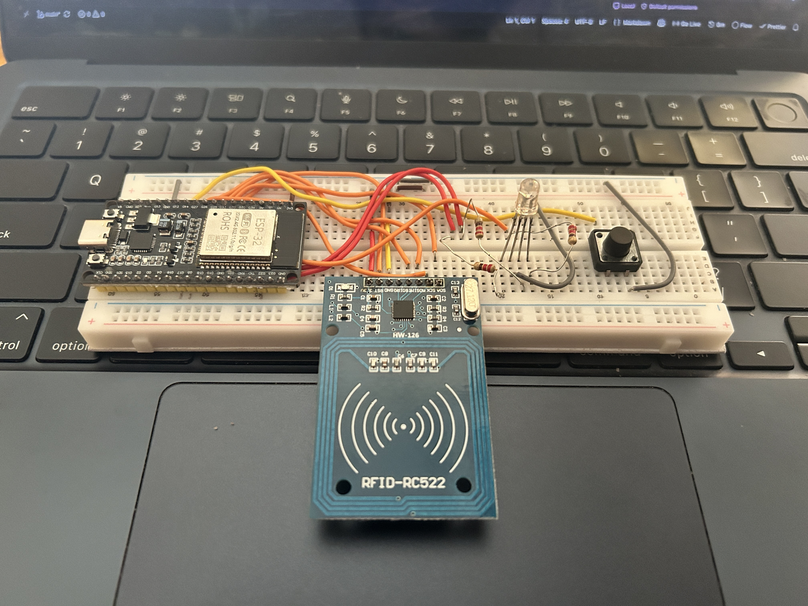


The GIF above is embedded directly so it can play inline in GitHub's README viewer.

### 3. Register a Reader

The reader advertises the mDNS hostname `reader`, so its portal is available at:

```text
http://reader.local/register-reader
```

The administrator enters an email address and reader password, selects one operating mode, and fills the mode-specific setting:

| Mode | Required configuration | Behavior when a card is tapped |
| --- | --- | --- |
| Identification | One or more authorized card UIDs | The reader checks the UID against `cardIds`. An authorized card is accepted and an entry is recorded. |
| Payment | A non-negative deduction amount | The reader retrieves the card balance. If sufficient, the API deducts the configured amount and records a payment entry. |
| Door lock | A four-character reader door code | The reader compares the reader code with the cardholder's stored door code. A match is accepted and an entry is recorded. |

The reader derives its unique `readerId` from the ESP32 Wi-Fi MAC address. The ESP32 refuses a second registration while a reader configuration is already loaded, and the registration payload is sent to the backend with this device identifier.

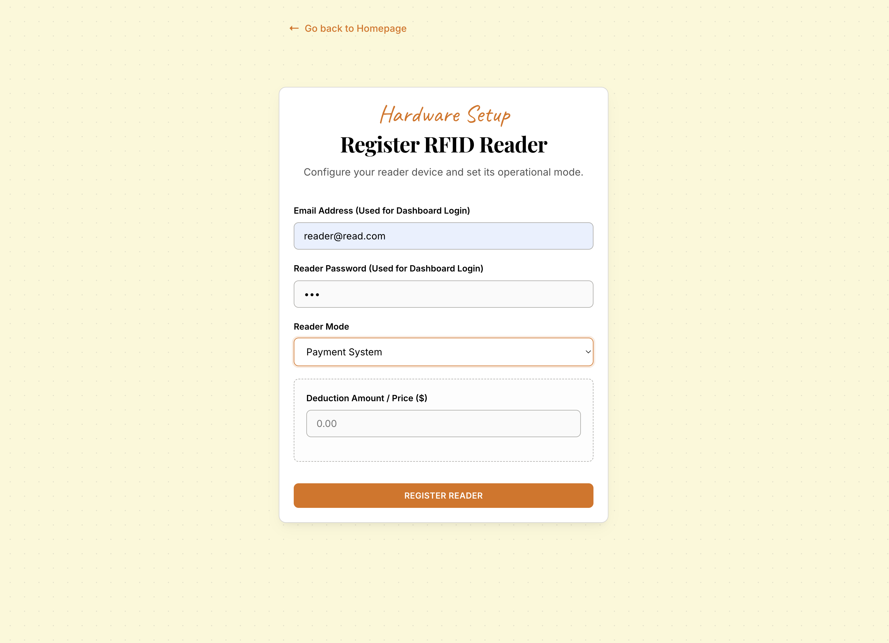

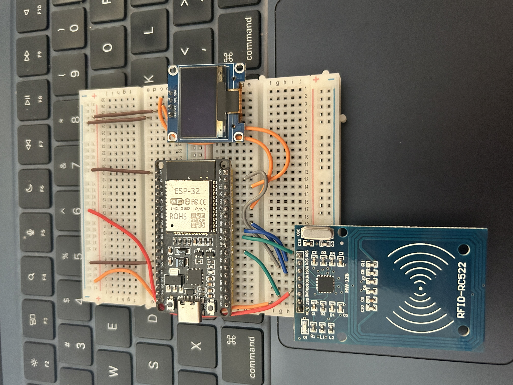

<video controls width="820" preload="metadata">
	<source src="./assets/hardware/reader_registration_hardware.MOV" type="video/quicktime">
	Your browser cannot play this QuickTime video. <a href="./assets/hardware/reader_registration_hardware.MOV">Download the reader registration demonstration</a>.
</video>

### 4. Use a Registered Reader

When a card is tapped, the reader:

1. Reads the UID from the RC522 module and normalizes it to lowercase.
2. Requests the matching card document from the API.
3. Applies the configured mode-specific authorization or payment rule.
4. Shows the result and cardholder's first name on the 128x64 SSD1306 OLED.
5. Creates a database entry when the operation succeeds.

The display can show states such as:

- `Card is not verified`
- `Reader Not Registered`
- `Not authorized!!`
- `Wrong Door code!!`
- `Not enough Balance!!`
- `Payment Successfull`
- `you are authorized`
- `Door code Matched`

The reader shows a verification message during the network request, holds the result for approximately five seconds, and then clears the OLED. Successful registration also displays an animated checkmark.

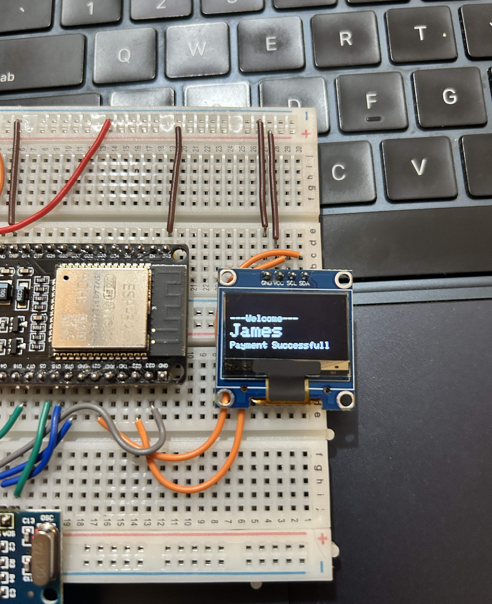

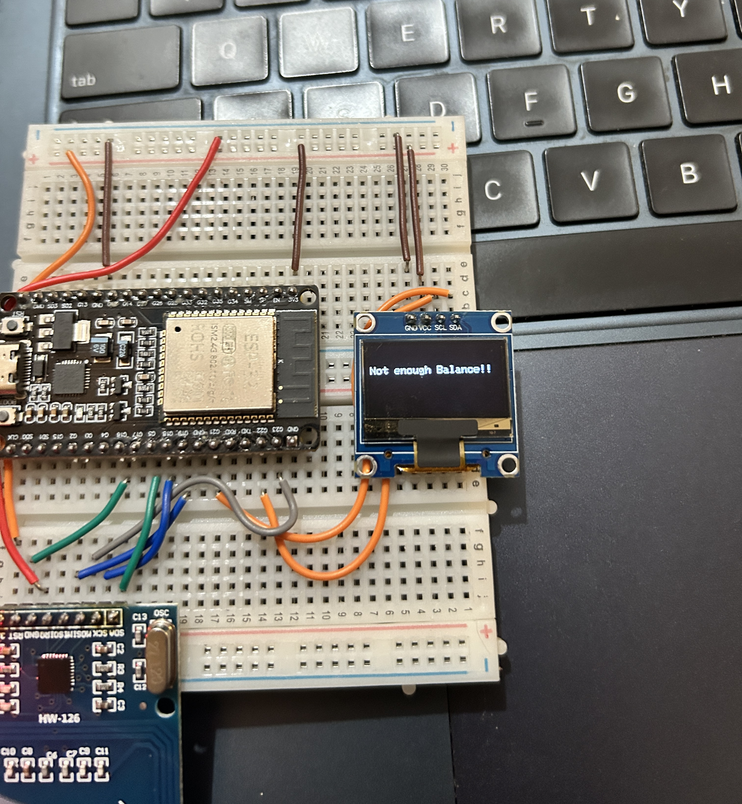

<video controls width="820" preload="metadata">
	<source src="./assets/hardware/card_registration_failed.MOV" type="video/quicktime">
	Your browser cannot play this QuickTime video. <a href="./assets/hardware/card_registration_failed.MOV">Download the failed card registration demonstration</a>.
</video>

## Cloud Web Interface

The cloud frontend is a Next.js application with three primary user experiences:

### Landing page

The landing page explains the ecosystem and provides links to the local writer portal, local reader portal, and dashboard login. External local-device navigation uses the mDNS URLs described above.


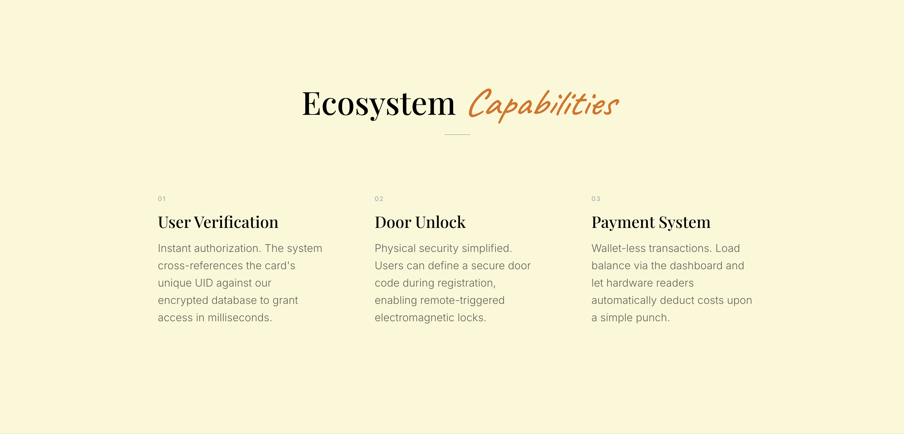

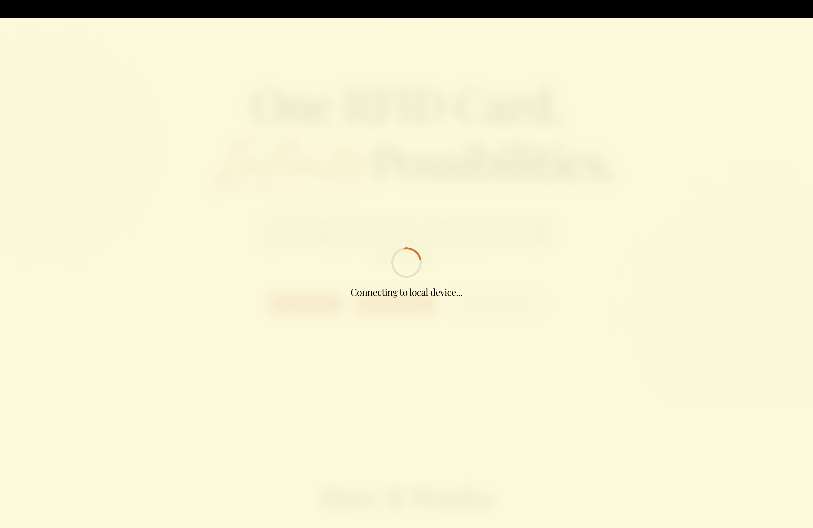

### Login

The login page has separate tabs for cardholders and reader administrators. Successful login creates a JWT-backed session token and routes the user to the matching dashboard.

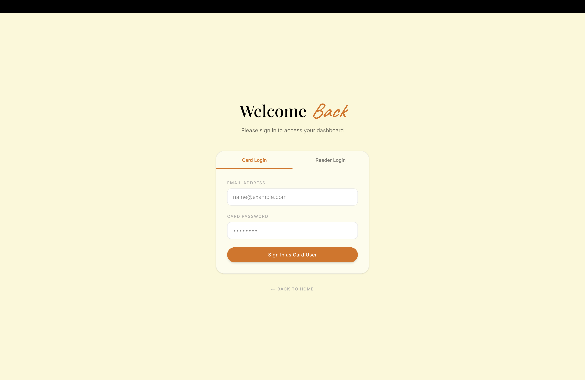

### Card dashboard

The card dashboard shows the cardholder's name, balance, card UID, contact details, door code, and card password. It is intended for the cardholder to confirm the current state of their UniCard.

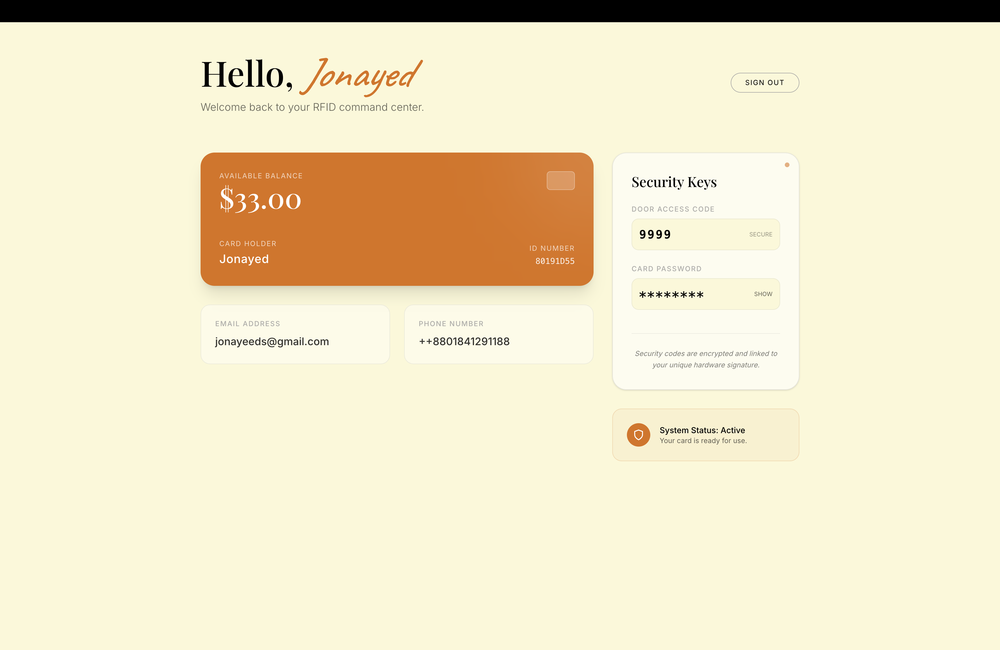

### Reader dashboard

The reader dashboard shows the reader ID, current mode, management email, mode configuration, authorized card list when applicable, and recent card activity. Reader administrators can reload entries without leaving the page.

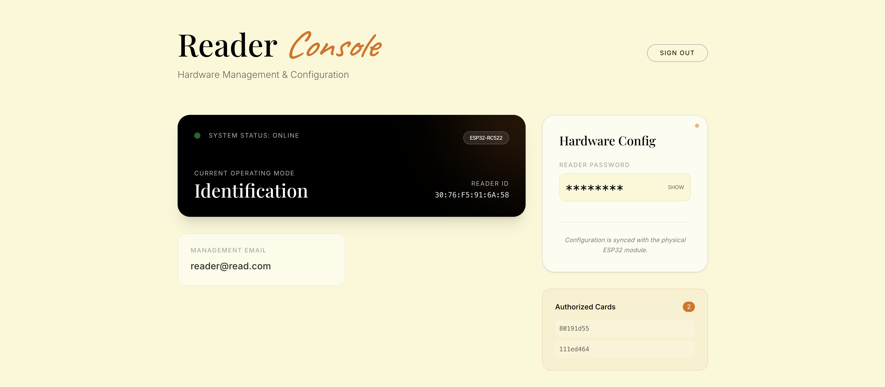

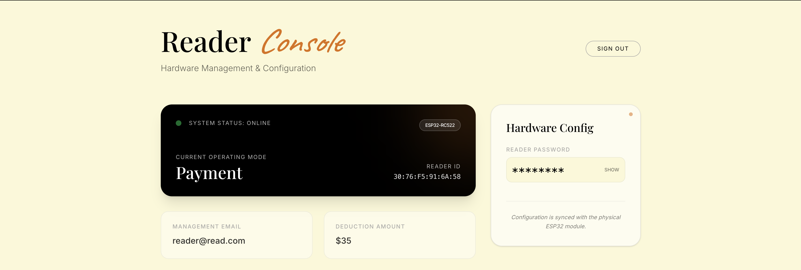

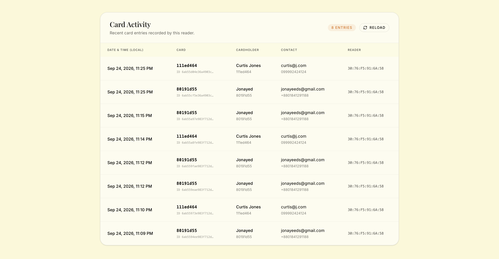

## Data Model

The API uses three MongoDB collections.

### `cards`

Card registration stores the card UID together with the cardholder profile:

```json
{
	"cardUID": "4a2b1c9f",
	"fullname": "Example User",
	"phoneNumber": "1234567890",
	"email": "user@example.com",
	"cardPassword": "dashboard-password",
	"doorcode": "1234",
	"balance": 25
}
```

### `readers`

Reader registration stores the ESP32-derived identifier and the selected mode settings:

```json
{
	"readerId": "AA:BB:CC:DD:EE:FF",
	"email": "admin@example.com",
	"readerPassword": "reader-password",
	"mode": "payment",
	"cardIds": null,
	"deductionAmount": 2.5,
	"doorcode": null
}
```

Only the mode-specific field is meaningful for a given reader. Identification uses `cardIds`, payment uses `deductionAmount`, and door lock uses `doorcode`.

### `entries`

Successful identification, door-lock, and payment operations create an entry:

```json
{
	"cardUID": "4a2b1c9f",
	"readerId": "AA:BB:CC:DD:EE:FF",
	"mode": "identification",
	"createdAt": "2026-01-01T12:00:00.000Z"
}
```

Reader dashboard queries join entries with card documents to display cardholder information while omitting the card password, balance, and door code from the joined result.

## API Reference

The deployed firmware currently targets:

```text
https://unicard-api.sajjadjonayed.com/api/v1
```

| Method | Endpoint | Purpose |
| --- | --- | --- |
| `POST` | `/register-card` | Inserts a cardholder document. Requires a UID and card profile fields. |
| `POST` | `/register-reader` | Inserts a reader document with its mode configuration. |
| `POST` | `/login-card` | Validates card email/password and returns a JWT. |
| `POST` | `/login-reader` | Validates reader email/password and returns a JWT. |
| `GET` | `/get-card/:cardUID` | Returns the card document used by a reader during a tap. |
| `GET` | `/get-reader/:readerId` | Returns the configuration used by a reader at startup. |
| `PATCH` | `/deduct-balance/:cardUID/:readerId` | Checks the balance, decrements the configured payment amount, and inserts a payment entry. |
| `POST` | `/add-entry` | Inserts an identification or door-lock entry. |
| `GET` | `/get-my-card` | Returns the authenticated cardholder's dashboard data. |
| `GET` | `/get-my-reader` | Returns the authenticated reader's configuration. |
| `GET` | `/get-entries` | Returns the authenticated reader's activity with safe card details joined in. |
| `GET` | `/health` | Returns the API health status. |

The Express server connects to MongoDB once and reuses the connection for subsequent requests. JWTs contain a user ID, email, and type (`card` or `reader`) and expire after ten days.

## Hardware and Pin Mapping

### Writer ESP32

| Function | GPIO |
| --- | ---: |
| RC522 RST | 32 |
| RC522 SDA/SS | 33 |
| RC522 MOSI | 25 |
| RC522 MISO | 26 |
| RC522 SCK | 27 |
| Reset button | 14 |
| Red LED | 17 |
| Green LED | 5 |
| Blue LED | 22 |

The writer uses a custom SPI pin assignment. The RGB LED is wired as active-low, so the firmware drives a pin low to turn its color on.

### Reader ESP32

| Function | GPIO |
| --- | ---: |
| RC522 SDA/SS | 5 |
| RC522 RST | 4 |
| OLED interface | I2C (`0x3C`) |
| OLED resolution | 128 x 64 |

The reader uses the default `SPI` initialization for the RC522 and an SSD1306 OLED over I2C.

## Software and Firmware Setup

### Required software

- Arduino IDE or another ESP32-compatible Arduino build environment
- ESP32 board support package
- Arduino libraries used by the firmware:
	- `WiFi`
	- `WiFiManager`
	- `WebServer`
	- `ESPmDNS`
	- `LittleFS`
	- `HTTPClient`
	- `ArduinoJson`
	- `SPI`
	- `MFRC522`
	- `Wire`
	- `Adafruit GFX`
	- `Adafruit SSD1306` for the reader
- A MongoDB deployment
- Node.js and npm for the backend and frontend

### Uploading the ESP32 devices

1. Open the relevant `.ino` file in the Arduino IDE.
2. Select the correct ESP32 board and serial port.
3. Install the required libraries.
4. Upload the firmware.
5. Upload the matching `data/` directory to LittleFS using an ESP32 LittleFS data-upload tool.
6. Restart the device and complete Wi-FiManager configuration if required.
7. Open `http://writer.local/register-card` or `http://reader.local/register-reader` from a client on the same Wi-Fi network.

The portals are served from LittleFS at `/register-card` and `/register-reader`; the firmware also redirects `/` to the appropriate portal.

### Backend configuration

Create `web_interface/cloud_hosted/backend/.env` with values similar to:

```env
DATABASE_URL=mongodb+srv://<user>:<password>@<cluster>/<database>
JWT_SECRET=<long-random-secret>
PORT=3001
```

Then run:

```bash
cd web_interface/cloud_hosted/backend
npm install
npm start
```

The backend package includes a Vercel configuration for cloud deployment. Do not commit `.env` files or database credentials.

### Frontend configuration

Set the backend URL for the Next.js server actions:

```env
SERVER_URL=https://unicard-api.sajjadjonayed.com/api/v1
```

Then run:

```bash
cd web_interface/cloud_hosted/frontend
npm install
npm run dev
```

The frontend contains routes for the landing page, login, card dashboard, and reader dashboard. The dashboard server actions read the JWT from the `token` cookie and call the protected API endpoints.

## Security and Reliability Analysis

The current design has a clear separation between local device registration and cloud authorization, but it should be treated as a prototype until the following areas are hardened:

- **Credential storage:** card and reader passwords are currently compared and stored as ordinary document fields. Production deployment should hash them with a password-hashing algorithm such as Argon2id or bcrypt.
- **Card UID as an identifier:** an RFID UID is not a cryptographic secret and can be cloned on some cards. Higher-assurance deployments should use cryptographic card authentication or an additional user/device factor.
- **Reader registration uniqueness:** the firmware prevents a second registration after it has loaded a mode, but the API should also enforce a unique index on `readers.readerId` to prevent duplicate registrations at the database boundary.
- **Payment concurrency:** the API validates the balance and then updates it. A production payment endpoint should use a transaction or a conditional atomic update so simultaneous taps cannot overspend a balance.
- **CORS and rate limiting:** the backend currently allows all origins and does not show request throttling. Restrict CORS to known frontend origins and add rate limits to login, registration, and card lookup routes.
- **Secrets in responses:** dashboard responses currently include sensitive credential fields because the UI has a show/hide control. Production APIs should avoid returning passwords entirely and provide a password-rotation flow instead.
- **Network dependency:** reader authorization requires Wi-Fi and the cloud API. The OLED reports failures, but the firmware does not queue offline taps. A resilient deployment could add a local policy cache and a durable event queue.
- **Configuration freshness:** the reader fetches its configuration during startup. A reboot or explicit refresh is needed for changes made in the dashboard or database to reach the device.
- **Transport and certificate validation:** the firmware uses HTTPS URLs for cloud requests. Production firmware should also verify the server certificate rather than relying only on the URL scheme.

These points describe the current implementation and are useful starting points for a production hardening roadmap; they do not change the intended three-mode workflow.

## Demonstration Media

The repository includes hardware captures and software screenshots under [`assets/`](./assets/):

- Hardware photos show the writer and reader assemblies and OLED outcomes.
- The card-registration GIF demonstrates the tap-and-submit workflow inline.
- The QuickTime demonstrations are linked through native HTML video controls above. GitHub's ability to play `.MOV` files depends on the browser's codec support; downloading the linked file is the fallback when inline playback is unavailable.
- Software screenshots cover the landing page, local registration pages, Wi-Fi setup, login, card dashboard, reader dashboards, and activity entries.

## Project Status

UNICARD is a working academic/prototype IoT ecosystem demonstrating RFID identity, access control, and payment flows across embedded devices and a cloud application. The implementation is intentionally split into small, understandable services so the hardware workflow, HTTP API, persistence layer, and dashboard can be developed and tested independently.

## License

No license has been specified for this repository yet.
